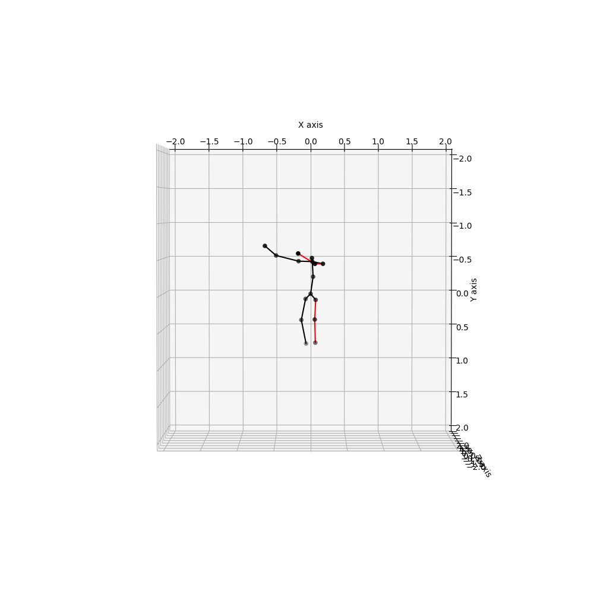

# Overview

Modified version of the original repository [here]{https://github.com/chaneyddtt/Generating-Multiple-Hypotheses-for-3D-Human-Pose-Estimation-with-Mixture-Density-Network}. Cleaned and edited to do cross-dataset analysis.

In the original paper, they used H36M's 2D basic 16 joints configuration (including root joint) to train, but for 3d they removed the root and replaced it with the noise joint. Meaning they were using the following indices for 2D joints: 

```
[0, 1, 2, 3, 6, 7, 8, 12, 13, 15, 17, 18, 19, 25, 26, 27]
```
and for 3d:
```
[1, 2, 3, 6, 7, 8, 12, 13, 14, 15, 17, 18, 19, 25, 26, 27]
```

For GPA, the original joint ordering appears to be flipped from the original one.

# Quantative Results

| Train(&#8595;) Test(&#8594;)   |  H36M  |  GPA   |  3DPW  | 3DPW_AUG | SURREAL |
|--------------------------------|--------|--------|--------|----------|---------|
| H36M                           |  61.46 | 140.95 |  97.66 |   152.53 |  156.63 |
| GPA                            | 135.37 |  70.23 | 130.03 |   188.21 |  179.80 |
| 3DPW                           | 125.65 | 128.83 |  67.15 |   142.13 |  131.78 |
| 3DPW_AUG                       | 162.54 | 154.22 |  95.88 |    78.64 |  118.95 |
| SURREAL                        |        |        |        |          |   65.21 |

## Command Line Args
```
--train_dir: Training will checkpoint initially at "experiments/${train_dir}"
--load_dir : Model will load and save later training progress at "experiments/${load_dir}"
--load     : checkpoint number (must if you specified load_dir)
--test     : True if you want to evaluate
--dataset  : Supported dataset: h36m, gpa, 3dpw, 3dpw_aug
--qual     : Test and save images to "out/${qual}"
```

# Qualitative Results
First 5 of each row are different hypothesis. And the last column is the ground truth.

## Train: 3DPW Test: 3DPW
| H1 | H2 | H3 | H4 | H5 | GT |
|----|----|----|----|----|----|
|  |  |  |  |  |  |
|  |  |  |  |  |  |
|  |  |  |  |  |  |
|  |  |  |  |  |  |

## Train: H36M Test: 3DPW
| H1 | H2 | H3 | H4 | H5 | GT |
|----|----|----|----|----|----|
|  |  |  |  |  |  |
|  |   |  |  |  |  |
|  |   |  |  |  |  |
|  |  |  |  |  |  |
|  |  |  |  |  |  |

## Train: GPA Test: 3DPW
| H1 | H2 | H3 | H4 | H5 | GT |
|----|----|----|----|----|----|
|  |  |  |  |  |  |
|  |  |  |  |  |  |
|  |  |  |  |  |  |
|  |  |  |  |  |  |
|  |  |  |  |  |  |

## Train: GPA Test: GPA
| H1 | H2 | H3 | H4 | H5 | GT |
|----|----|----|----|----|----|
|  |  |  |  |  |  |
|  |  |  |  |  |  |
|  |  |  |  |  |  |
|   |  |  |  |  |  |
|  |  |  |  |  |  |

## Train: GPA Test: H36M
| H1 | H2 | H3 | H4 | H5 | GT |
|----|----|----|----|----|----|
|  |  |  |  |  |  |
|  |  |  |  |  |  |
|  |  |  |  |  |  |
|  |  |  |  |  |  |
|  |  |  |  |  |  |


| GPA_FLIPPED                    | 196.20 |        | 164.10 |   176.34 |       72.08 |